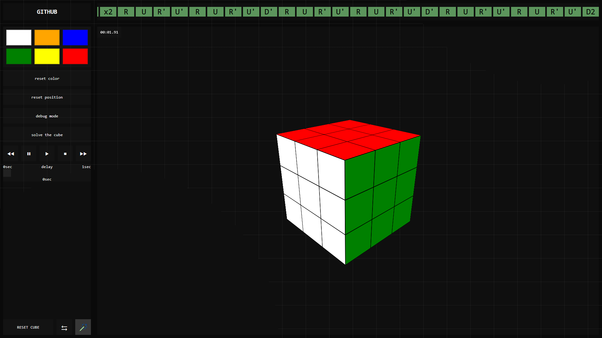

# Rubik's Cube

L'idée de ce projet vient de mon petit frère, passionné de Rubik's Cube. Il m'a fait découvrir ce casse-tête que j'ai appris à résoudre avant qu'il ne me dépasse à son tour. Fasciné par la complexité de sa résolution, j'ai voulu comprendre si j'étais capable de la recréer moi-même : j'ai donc reconstruit chaque algorithme à partir de mes souvenirs, sans vidéo, sans tutoriel et sans aucune aide extérieure, uniquement à partir de mes expériences de résolution du cube à la main.

Simulateur de Rubik's Cube 3D développé en HTML, CSS et JavaScript.

## Fonctionnalités

- [x] Rotation des faces
- [x] Rotation des couches internes (M, E, S)
- [x] Historique des mouvements
- [x] Mélange aléatoire
- [x] Contrôles de lecture
- [x] Personnalisation des couleurs
- [ ] Personnalisation des stickers / scan IRL
- [x] Résolution complète (7/7)
- [x] Chronomètre de résolution

## Performance de l'algorithme

- Mélange aléatoire : **20 mouvements**
- Résolution : **~150 mouvements en moyenne**
- Délai entre les mouvements : **0 s**
- Record observé : **1,91 s**

Ce test permet de mesurer la capacité de l'algorithme à résoudre rapidement le cube, sans délai artificiel entre les mouvements.

## Combat humain vs ordinateur

Test réalisé à armes égales contre mon petit frère.

Son record étant d'environ **20 à 35 secondes**, j'ai fixé un délai de **0,2 s entre chaque mouvement** pour l'ordinateur. Avec une résolution moyenne de ~150 mouvements, cela représente environ **30 secondes** de délai cumulé.

> Deux manches préliminaires à **0,3 s par mouvement** ont servi de **manches de chauffe** et à **calibrer la vitesse de l'ordinateur**.

| Participant | Victoires |
|-------------|-----------|
| 🤖 Ordinateur | **6** |
| 👤 Humain | **4** |

**Résultat : 6–4 pour l'ordinateur.**

## Performances du site

Le site a été testé avec **Google Lighthouse** afin d'évaluer ses performances sur mobile et ordinateur.

| Indicateur | 📱 Mobile | 🖥️ Ordinateur |
|:---|:---:|:---:|
| **Performances** | **100/100** | **100/100** |
| **Accessibilité** | **100/100** | **100/100** |
| **Bonnes pratiques** | **100/100** | **100/100** |
| **SEO** | **100/100** | **100/100** |
| First Contentful Paint | 0,9 s | 0,2 s |
| Largest Contentful Paint | 1,1 s | 0,2 s |
| Total Blocking Time | 0 ms | 0 ms |
| Cumulative Layout Shift | 0 | 0 |
| Speed Index | 0,9 s | 0,3 s |

>Les tests ont été réalisés le **20 août 2026** avec **Lighthouse 13.4.1**, sur une connexion 4G simulée pour mobile et en configuration ordinateur.

## **[Découvrir le projet](https://seyyko.github.io/rubicksCube/)**

